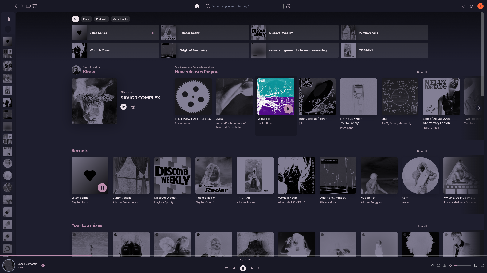

# Turntable Negative

A quiet Spotify. Dark Catppuccin-Mocha base, a soft mauve accent, cover art rendered
as an **inverted duotone**, and a deliberate removal of the things that pull your eye
around — video shelves, browse artwork, the colour noise of the category grid.



Built on [Turntable](https://github.com/grasonchan/spotify-spice) by Grason Chan.

---

## What "negative" means

The duotone filter maps each cover's luminance onto two colours. The defaults here map
**light → black** and **dark → grey**, which is the inverse of the usual direction:
covers come out looking like photographic negatives. Hovering a cover brings the
original back.

This is the signature of the theme, and it is one line to change — see
[Tuning the duotone](#tuning-the-duotone).

## What it is not

It does not stop everything from moving. The turntable still spins while a track plays,
and Spotify's scroll-linked carousel animations still run. What is removed is video
content, artwork that carries no information, and the twenty-seven background colours of
the browse grid.

---

## Requirements

- [Spicetify](https://spicetify.app/) v2.2.0 or newer (Turntable's rotation needs it)
- [`fullAppDisplay.js`](https://github.com/spicetify/cli/blob/main/Extensions/fullAppDisplay.js) —
  required by Turntable, ships with Spicetify. Not bundled here.
- `overwrite_assets = 1` in `config-xpui.ini`, for the recoloured equaliser icons

## Install

### Via Marketplace (recommended)

Search for **Turntable Negative** under Themes. The extensions and the turntable
rotation script are pulled in automatically through the theme's `include` field.

**One thing Marketplace cannot deliver:** the recoloured equaliser icons. Marketplace
theme installation injects the colour scheme, `user.css` and the scripts listed in
`include` — it does not copy asset files. The small "now playing" equaliser animation
therefore stays Spotify green. If that bothers you, install manually instead; everything
else is identical.

### Manually

```bash
git clone https://github.com/Lourixes/turntable-negative
cd turntable-negative

# theme
cp -r theme ~/.config/spicetify/Themes/TurntableNegative

# extensions
cp extensions/*.js ~/.config/spicetify/Extensions/

spicetify config current_theme TurntableNegative color_scheme mocha
spicetify config overwrite_assets 1 inject_theme_js 1
spicetify config extensions accent-fixups.js
spicetify config extensions duotone-covers.js
spicetify config extensions hide-videos.js
spicetify config extensions npv-collapse.js
spicetify config extensions playbar-track-options.js
spicetify config extensions home-lazy-shelves.js
spicetify config extensions browse-calm-cards.js
spicetify config extensions fullAppDisplay.js
spicetify apply
```

---

## The extensions

Each one is independent and can be switched off on its own with
`spicetify config extensions <name>.js-` followed by `spicetify apply`.

| Extension | What it does |
|---|---|
| `duotone-covers.js` | Cover art as a two-colour duotone, original on hover |
| `accent-fixups.js` | Removes leftover Spotify green from button states, pins the home header colour, aligns stray icons |
| `hide-videos.js` | Hides video episodes, video-only shelves, and "Similar music videos" |
| `npv-collapse.js` | Hides the right sidebar while it only shows Now Playing |
| `playbar-track-options.js` | Track context-menu button in the player bar; right-click toggles Now Playing |
| `home-lazy-shelves.js` | Defers off-screen home shelves until you scroll near them |
| `browse-calm-cards.js` | Neutralises the "Browse all" tiles — no colours, no artwork |

### A note on performance

Two of these came out of measuring, not guessing.

**`home-lazy-shelves.js`** — Spotify's home page keeps all 12 shelves (~375 elements
each, ~6,500 in total) laid out at once while about four fit on screen. Deferring the
rest cut a full style recalculation plus layout from 60–66 ms to 32–40 ms, roughly
**45% less work per recalculation**. It uses `content-visibility: hidden` rather than
`display: none` so the shelves keep their height and the scrollbar stays put; measured
scroll height was unchanged.

Honest caveat: the CPU spike when home first renders did **not** measurably improve
(94.5% vs 102.7% average over three rounds — inside the noise). The gain is in
interaction, not in page load.

**`hide-videos.js`** turned out to be a net performance win as well: with it disabled,
long-frame time on home rose from 471 ms to 1,254 ms per 3.3 s of mouse movement,
because Spotify then actually renders the video content.

---

## Tuning the duotone

The colours live at the top of `duotone-covers.js`:

```js
const FALLBACK_DARK  = "#837f95";  // shadows
const FALLBACK_LIGHT = "#000000";  // highlights
```

Swapping them gives you a conventional duotone instead of a negative. A `:root`
custom property wins over both, if you would rather set it from CSS:

```css
:root { --ct-duotone-light: #d9c8d3; --ct-duotone-dark: #11111b; }
```

`extras/spotify-duotone` is a small helper that edits those values, applies and
restarts for you:

```bash
spotify-duotone '#d9c8d3' --dark '#11111b'
spotify-duotone                              # show current values
```

## Palette

`theme/color.ini` is a [Catppuccin Mocha](https://github.com/catppuccin/catppuccin)
base — `main #1e1e2e`, `card #313244`, `shadow #11111b` — with a custom mauve accent
(`button #bc8ead`) and a warmer text tone (`text #ede3ea`) that are not part of the
Catppuccin palette.

## extras/

Not part of the Marketplace package; Arch Linux specific, take what is useful.

- **`spotify-duotone`** — helper for the duotone colours, put it on your `PATH`
- **`spotify-flags.conf`** — goes to `~/.config/spotify-flags.conf`. The
  `--force-device-scale-factor=1` flag counteracts `GDK_SCALE=2` on HiDPI setups.
  Note that `/usr/bin/spotify` is a wrapper that reads this file — a `.desktop`
  override is ignored.
- **`99-spicetify.hook`** — pacman hook that re-applies Spicetify after a Spotify
  update. **Replace `%USER%` with your username** before copying it to
  `/etc/pacman.d/hooks/`.

## Credits

- [Turntable](https://github.com/grasonchan/spotify-spice) by Grason Chan — the base theme, MIT
- [Catppuccin](https://github.com/catppuccin/catppuccin) — the Mocha palette
- [Spicetify](https://spicetify.app/)

## Licence

MIT, see [LICENSE](LICENSE). Turntable's original copyright is retained there.
